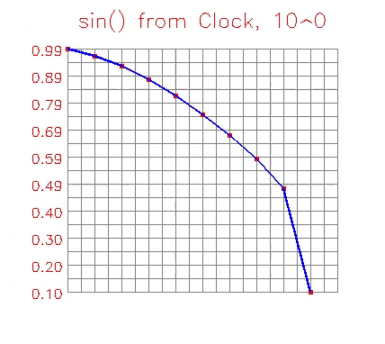

# PLOT IN NUMPY FAST

Justpyplot plots given `values` to a given NumPy ndarray, adapting
the plot scale and size to fit the input data.
Plots fast - the ironclad policy of no single loop in critical path,
not even for fanciness like thickness for connecting line segments
It is measured at 20-100x faster matplotlib.
```
timer "full justpyplot + rendering": avg 382 µs ± 135 µs, max 962 µs
```
Useful for overlaying real-time plots on images and video frames, or
in jupyter.
## MOTIVATION
Doing dances around matplotlib by getting figures not auto displayed, converting figure bytearray to numpy (which is different by
backend, i.e surprising  behavior on different platforms), or using moviepy, etc all
to suffering multimillisecond performance hit just didn't do it for me. I needed plots to measure and see real things happening. 

This code is a quick example for people who want to see how to do things in vectorized way.

If there's enough pain with matplotlib points above maybe it will be taken to a public usage level.

## INSTALATION

You can copy plot files respecting the license, or for use in Jupyter notebooks more convienent to:
```bash    
pip install justpyplot
```
## BASIC USAGE


You can explore the documentation for the justplot function currently, options probably support any 
flexing or adjusting the plot as you need such as colors, scatter, connected with line thickness, labels, etc

Basically you just create two matching arrays for the dependency you plot and pass it to the justplot with where your plot to be sticked (numpy array, mask in memory, etc) and it does it. Adjust your function .
```python
import numpy as np 
import cv2

import justpyplot as jplt


xs, ys = [], []
c = 0
while(c != 27):
    xt = time.perf_counter() - t0
    yx = np.sin(xt)
    xs.append(xt)
    ys.append(yx)
    
    frame = np.full((500,470,3), (255,255,255), dtype=np.uint8)
    
    vals = np.array(ys)

    drawn = jplt.just_plot(frame, vals,title="sin() from Clock")
    
    cv2.imshow('frame', drawn)
    c = cv2.waitKey(1)
```
