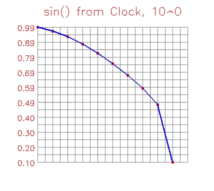

<h1 align="center"># Plot in Numpy, Debug Visually Real-Time</h1>

<p align="center">
  
</p>

This is concept of the real-time, vectorized plotting library
which gets your plot as a numpy array controlling every basic part
of it you may need - including opacity;
All plots can adapt to values ranges real-time;

Consequently allows for all kinds of visual debugging, overlaying, 
tweaking and streaming.

Also it allows direct simple access to all elemntal properties and 
is measured at 20-100x faster then matplotlib.
```
timer "full justpyplot + rendering": avg 382 µs ± 135 µs, max 962 µs
```

## MOTIVATION
Status Quo, i.e. the matplotlib and close require 
5-6 step  to get numpy array image of plot from your data. It's on par with screenshotting after displaying you plot or going into monitor buffers for plot portion image. That makes you suffer multimillisecond performance hit. Obvioudly it's very unpleasant and abnormal to ever write such hoopla and it is unworkable if you need to and for tweaking the images and more importantly real-time application, such as visual debugging of computer vision or physical camera applications.

Luckily it took me less time to write this to satisfy every plotting every basic plotting need then to make matplotlib to work like this.

Also!
This code is a quick example for people who want to see how to do things in vectorized way.

If you, the reader, communicate enough need for real-time plotting, visual debugging for camera/computer vision applications and quick image graphs, I will take this library to a solid level, with competitive feature set.

## INSTALATION

You can copy justplot file code respecting the license;
For use in Jupyter notebooks its convienent to:
```bash    
pip install justpyplot
```
## BASIC USAGE



You can explore the documentation for the justplot function currently, options probably support any  flexing or adjusting the plot as you need such as colors, scatter, connected with line thickness, labels, etc

You just pass one or two arrays signifying dependency and pass it to the justplot.
You can plot on exiting image frame at specified offset by plot1_at, plot2_at function or directly generate plot mask, you can completely control opacity of every element as well as every graphical or textual parameter of the plot.

```python
import numpy as np 
import cv2
import time
import justpyplot as jplt

xs, ys = [], []
while(cv2.waitKey(1) != 27):
    xt = time.perf_counter() - t0
    yx = np.sin(xt)
    xs.append(xt)
    ys.append(yx)
    
    frame = np.full((500,470,3), (255,255,255), dtype=np.uint8)
    
    vals = np.array(ys)

    plotted_in_array = jplt.plot1(frame, vals,title="sin() from Clock")
    
    cv2.imshow('np array plot', plotted_in_array)
```
