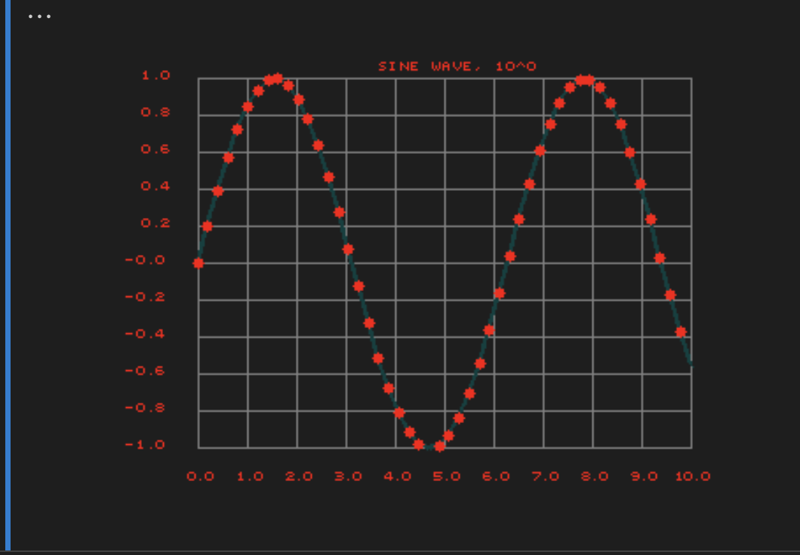

## Installation

```bash
pip install justpyplot
```

<h1 align="center">Why not just get your plots in numpy?! </h1>
Why not just have a simple API

plot(values, grid_options, figure_options, ...) ->
(__figures__, __grid__, __axis__,__labels__)

 which renders plot in numpy/tensors and you can overlay, mask, transform, publish in any way you want whilst fully controlling every detail of your plot and figures?

<h1 align="center">JustPyPlot: Fast NumPy-Native Plotting</h1>


## So Why?
- **Fast**: Vectorized plotting directly to NumPy arrays - no memory screenshots or buffer copies
A high-performance plotting library that renders directly to NumPy arrays. Measured 20-100x faster than matplotlib:
```bash
timer "full justpyplot + rendering": avg 382 µs ± 135 µs, max 962 µs
```
- **Simple**: Get all plots parts as arrays with a single function call 
```python
figure, grid, axis, labels = jplt.plot(values,grid_opts,figure_opts,title,(600, 400))
```
and put them on, in or into everwhere you need in 1-2 subsequent lines

- **Flexible**: Control every plot element (figures, grid, axis, labels) and every detail of plotting options independently, all design options are parsed from json-style figure and grid option dicts with full documentation available: https://justpyplot.readthedocs.io/en/latest/

- **No dependencies**: Just vectorized python with numpy(+ other tensor lib you need), which makes standalone and compatible with any use case

- **Small** Less then 20K total and 1000 total of core code which you can all understand


- **Real-time**: Was initially scrapped for computer vision and robotics for real-time visualization and physical debugging tasks where standard plotting failed

- **ML/AI Pluggable**: You can, for example stick it onto visual layers of neural network for it to learn your plotted characteristic without changing any dimensions. 

## BASIC USAGE


You can explore the documentation for the plot function which supports any flexing or adjusting of the plot as you need such as colors, scatter, connected with line thickness, labels, etc.

```python
import numpy as np 
import cv2
import time
from justpyplot import justpyplot as jplt

t0 = time.perf_counter()
xs, ys = [], []

while(cv2.waitKey(1) != 27):  # Press ESC to exit
    xt = time.perf_counter() - t0
    yx = np.sin(xt)
    xs.append(xt)
    ys.append(yx)
    
    # Create plot data array
    plot_data = np.array([xs, ys])
    
    # Generate plot arrays with customized options
    figure, grid, labels, title_img = jplt.plot(
        plot_data,
        grid={'nticks': 5, 'color': (128, 128, 128, 255)},
        figure={'scatter': True, 'line_color': (255, 0, 0, 255), 'line_width': 2},
        title="sin() from Clock",
        size=(600, 400)
    )
    
    # Blend all plot layers into single image
    plotted_array = jplt.blend(figure, grid, labels, title_img)
  
    
    cv2.imshow('np array plot', plotted_array)
```


### Overlaying Multiple Plots

 You take to take your plot which you can mask, stretch, transform and render wherever in frame array/canvas/memory you need and just overlay it simpler in one line?

Here 1-liner function implementing those basic steps stuck on running mug neural network.
In 3 lines of code it shows how to mess and visually debug 3d position of computer vision/robotics object in physical world (try in examples/mug_objectron/demo.py):

<p align="center">
  
</p>

```python
jplt.plot1_at(image, ang_zs,
            title='Angle from Z axis', offset=(50,50), size=(270, 300),
            point_color=(255,0,0),line_color=(255,0,0), label_color=(255,0,0), grid_color=(126,126,126))
jplt.plot1_at(image, ang_ys,
          title='Angle from Y axis', offset=(400,50), size=(270, 300),
          point_color=(0,255,0), line_color=(0,255,0),label_color=(0,255,0), grid_color=(126,126,126),
          scatter=False)
jplt.plot1_at(image,ang_xs,
          title='Angle from X axis', offset=(750,50), size=(270, 300),
          point_color=(0,0,255), line_color=(0,0,255),label_color=(0,0,255), grid_color=(126,126,126),
          scatter=False)
```

### Jupyter Notebook Usage

For jupyter support you can render images anyhow you like. One of the simplest is to use the blend2PIL function depening on Pillow package which will blend all the plot layers into a single PIL image buffer which you display in notebook

```python
import numpy as np
from IPython.display import Image as ipyImage, display
from justpyplot import justpyplot as jplt

# Make some dependency data
x = np.linspace(0, 10, 50)
y = np.sin(x)

# Just plot in numpy using the plot() function
figure_img, grid_img, labels_img, title_img = jplt.plot(
    np.array([x, y]),
    grid={'nticks': 10, 'color': (128, 128, 128, 255), 'label_color': (255, 0, 0, 255),'precision': 1, 'label_font_size': 0.9},
    figure={'scatter':False,'point_color': (255, 0, 0, 255), 'point_radius':3, 'line_color':(0,64,64, 255), 'line_width': 2, 'marker_style':'circle'},
    title='Sine Wave',
    size=(300, 400),
    max_len=100
)

# blend arrays into PIL picture buffer (requires Pillow)
buffer = jplt.blend2PIL(grid_img, figure_img, labels_img, title_img, format='PNG')

# Display the image
display(ipyImage(buffer.getvalue()))
```

<p align="center">
  
</p>

### Documentation

Documentation is fully available at https://justpyplot.readthedocs.io/en/latest/


